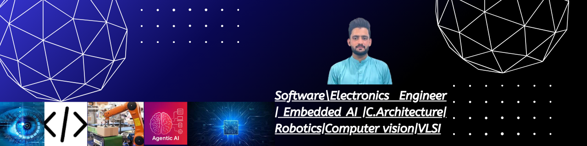

<!-- Top badges -->

  
  
  
  

  

---

## 📌 About Me
- Scored **120/160** in Duolingo English Test (IELTS **6.5/9** equivalent).  
- Selected as **Team Leader** in academic projects.  
- Awarded **state merit scholarship** at university.  
- Led **50+ volunteers** to prepare **500+ underprivileged students** for entrance exams.  
- Conducted **YOLO optimization research** — paper under IEEE review.  

---

## ⚙️ Skills

**🔬 AI/ML**  
`YOLOv8` `PyTorch` `NumPy` `OpenCV` `Scikit-learn`

**🌐 Frontend**  
`HTML` `CSS` `JavaScript`

**🛠 Backend**  
`Node.js` `Flask`

**🧰 Code Editors**  
`VS Code` `MATLAB` `Arduino IDE`

**🧑‍💻 Languages**  
`Python` `C++` `VHDL` `Verilog`

**🧳 Other Tools**  
`Git` `LaTeX` `CoppeliaSim` `PLC Ladder Logic`

---

## 🌍 International Hackathon
- **ETH Global – Roblox Styler Agent**  
AI-powered Roblox outfit generator using Node.js, Coral Protocol, Mistral AI.  
_Deployed on Nebius AI, registered in Coral Registry._  

  

👉 [Hackathon Project Page](https://lablab.ai/event/internet-of-agents/roblox-marketplace-ai/roblox-marketplace-agent)

---

## 🎓 Academic Projects
- **Fruit Quality Detection (YOLOv8)** — [Research work](https://drive.google.com/file/d/1l7DIGvR88hxMoFmObeTmAsxi1EJdHD1i/view?usp=drivesdk)  
- **Vending Machine (Verilog, Spartan XC400)** — [Report](https://drive.google.com/file/d/1MUcOKalmxKPxUX2KSLzeLqE8pO48Oo1t/view?usp=sharing)  
- **Student Performance Predictor (ML + Web)** — [Live Demo](https://ai-gpa-predictor.onrender.com/) | [Report](https://drive.google.com/file/d/1ECDrtKkW0nQosUWe1i6EVG9sv7e6ReES/view?usp=sharing)  
- **PLC Industrial Automation (Siemens & Fatek PLCs)** — [List of tasks performed](https://drive.google.com/file/d/1rznTFA4-DYqmqUUi61ngAX1QEqGN94sH/view?usp=sharing)  
- **Home Automation (Arduino,mobile app,control(Motor,Bulb,Fan))** — [Report](https://drive.google.com/file/d/1NV5BGY3g_vNZIjngKKXBd6BCwd0D3wbW/view?usp=drivesdk)

---
## 🏆 Achievements & Certifications

  

---
## 🔗 Connect With Me

  
  
  
  
  

